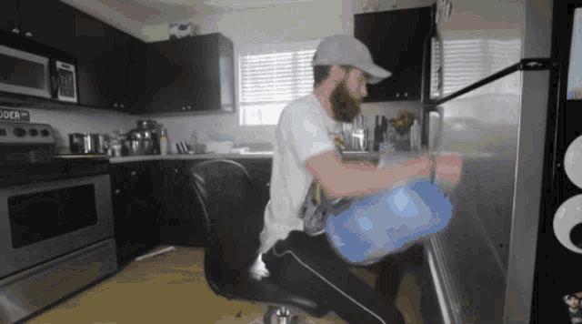

### 2 discord servers:

Self-explanatory, its just mentioning the 2 discord servers. Also when saying "2 discord servers", its mostly referring to content of this type.

Example:

*<code>Mr O is probably on those 2 discord servers again.</code>*

### On a call:

Calling someone while on those 2 discord servers or sometimes being on the 2 discord servers with said person.

Example:

*<code>Mr O: cant rn im on a call with Ms L</code>*
 
*<code>Mr Om: suure</code>*

### Jar:

Where the results of Mr O's fun go.

Example:

*<code>You need better aim or you'll miss the jar.</code>*

### On them all day:

When Mr O is online on discord all day.

Example:

*<code>damn Mr O must have a lot of fun, we was on them all day today</code>*

### Geyser:

When Mr O explodes and a liquid leaves his body.

Example:

